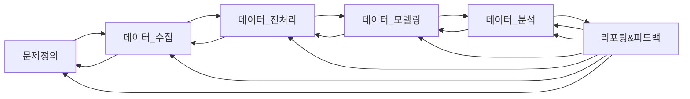

---
#### *1.1.3. 데이터와 분석계획, 분석모델*
---

## 1) 빅데이터분석

빅데이터 분석은 보통 *전자상거래, 모바일 디바이스, 소셜 미디어나 사물 인터넷(IoT)과 같은 다양한 출처에서 생성된 대규모의 다양한 데이터 세트(즉 빅데이터)를 검사하는 복잡한 프로세스*를 말합니다.
다양하고 방대하며 빠르게 변화하는 데이터 세트에서 인사이트를 수집, 처리, 파생하는 데 사용되는 방법, 도구 및 애플리케이션
빅 데이터 분석_은 방대한 데이터 세트에서 패턴, 추세 및 관계를 찾는 프로세스

## 2) 데이터

- 정성적 데이터(qualitative data) : 언어∙문자 등 비정형 데이터, 상대적으로 많은 비용과 기술적 투자가 수반
- 정량적 데이터(quantitative date) : 수치∙도형∙기호 등, 저장∙검색∙분석 활용에 용이

## 3) 분석모델

*1. 분류 모델:*
- 데이터 포인트가 특정 카테고리에 속하는지 예측하는 데 사용됩니다.
- 예시: 스팸 메일 필터링, 고객 유형 분류, 신용 위험 평가
*2. 예측 모델:*
- 과거 데이터를 기반으로 미래 값을 예측하는 데 사용됩니다.
- 예시: 주가 예측, 매출 예측, 고객 이탈 예측
*3. 군집화 모델:*
- 유사한 특성을 가진 데이터 포인트를 그룹으로 묶는 데 사용됩니다.
- 예시: 고객 세분화, 시장 조사, 생물학적 데이터 분석
*4. 이상 탐지 모델:*
- 데이터에서 정상 범위를 벗어나는 데이터 포인트를 식별하는 데 사용됩니다.
- 예시: 사기 거래 감지, 네트워크 침입 감지, 의료 진단
*5. 추천 모델:*
- 사용자에게 적합한 제품, 서비스 또는 콘텐츠를 추천하는 데 사용됩니다.
- 예시: 온라인 쇼핑 추천, 영화 추천, 음악 추천

### 머신러닝 방식 비교:

![[analysis_ML.png]]

- *지도 학습(Supervised Learning)*
- *비지도 학습(Unsupervised Learning)*
- *준지도 학습(Semi-Supervised Learning)*
- *강화 학습(Reinforcement Learning)*

## 4) 결과 보고서

- 전체 프로젝트 단계의 모든 기록 정보가 모두 필요하다.
- 기획단계 : 목적, 대상, 기간, 방법, 예상도출결과 형식, 평가방법 등 기획단계의 정보 
- 데이터 수집단계 : 데이터의 출처, 특성, 수집방법, 지속성, 정제방법, 저장방법, 관리방법
- 분석단계 : 분석방법의 선정, 분석방법의 비교, 분석과정, 데이터입력 과정, 분석결과, 
- 결과 정리 : 최종 보고서, 관련자료, 분석 소스

---
## 1) 분석 모델 과정
---

*현재 우리가 배우고 있는 과정에 대해서 이해를 가져보자!!!*

### 데이터 분석 절차 (데이터 분석에도 해당)

- 분석 프로젝트의 수립에서 분석 프로젝트의 목적과 목표가  먼저 확정되어야 한다.
- 문제정의 :  목표와 목적에 의해서(분석을 통해서 목표하는 또는 기대하는 결과) 분석하고자 하는 대상에 대한 구체적 문제정의(대상정의)
- 데이터 원천 선정: 문제정의로 부터 분석에 필요한 데이터와 데이터 원천에 대하여 확정한다.
- 데이터 수집: 확정된 데이터 원천으로 부터 데이터를 수집한다.
- 데이터의 검정 및 평가 : 수집된 데이터의 정확성, 일관성, 완전성 등 수집된 데이터를 검정하고 사용할수 있는 데이터 인지 평가
- 수집된 데이터의 선택 : 분석에 사용될 수 있는지 실효성 등을 평가하여 변수 선택.  
- 데이터 전처리: 결측치 처리, 이상치 제거, 변수 변환 등을 통해서 분석 모델에 사용할 수 있도록 정제하는 과정 
- 데이터 모델링: 문제정의에 맞게 데이터를 분석하기 위한 분석 기법, 분석 모델을 수립하는 과정
- 데이터 분석: 실제 분석 기법 및 모델을 적용하여 데이터를 분석
- 리포팅&피드백: 최종 분석 결과를 보고서로 작성 및 결과에 대한 피드백 확인

*ETL 과 EDA (Exploratory Data Analysis) 이 진행되는 실제 위치는 ??? *

그러나 데이터 분석에서 그치지 않고 분석 모델을 만들어 서비스하는 과정까지 생객해 보면 다음과 같이 확장될 수 있다.

- MLOps (Machine Learning Operations)

![[MLOPS_1.png]]

![[MLOPS_2.png]]

[MLOps](https://arxiv.org/ftp/arxiv/papers/2205/2205.02302.pdf)

![[MLOPS_archi.png]]

데이터 분석에서는 분석 기법이나 분석 모델 보다 분석 목적과 분석결과(정보)에 중점이 있다고 할 수 있다.
그러나 연구(개발)에 서비스(배포)가 추가되어 상품으로서 제공되는 부분이 결합되면 서비스되는 분석결과(정보) 만큼 서비스되는 모델의  

#### Data WareHouse 
: 다양한 원천의 데이터를 수집, 정제, 저장하여 분석, 모델링에 사용하여 보고서 시각화 등으로 정보 제공하는 전체적 시스템으로 인식되고 있음.
#### Data Lake(데이터 레이크)
: 생 데이터(raw data)를 거대한 저장소
#### Data PipeLine 
: 데이터를 한 시스템에서 다른 시스템으로 효율적이고 안정적으로 이동, 변환, 관리하는 체계적인 프로세스
ex) Airflow는 Apache Software Foundation에서 개발한 오픈 소스 워크플로 관리 시스템. Python 코드를 사용하여 데이터 파이프라인을 작성하고 스케줄링, 모니터링하는 기능을 제공

*관련 서비스나 프로그램에 대해서 조사 - ex) Luigi,  Kafka, Dagster,  ...  hadoop  et al*
=> spark

#### ETL
: Extract, Transform, Load의 약자로, 데이터 웨어하우스 및 데이터 파이프라인에서 사용되는 기본적인 프로세스

#### 통계적 샘플링  => 데이터 수집에서 고려할 만한 사항
![[Pasted image 20240318175648.png]]

---
### 학습 데이터의 분할 

![[Pasted image 20240318172813.png]]

- 보통 전체 데이터의 70~80~90%를 학습에 또는 분석에 사용하고 검증에 10~30% 데이터를 사용한다. (일반적으로는 20:80 비율) 
- 딥런닝의 경우 Train 80% validation 10% test 10%,  train 70% validation 15% test 15%, train 60% validation 20% test 20%
- 정답은 없음. 모델의 검증이 중요하면 validation과 test 셋의 크기를 충분히 가져가는 것이 좋다.
- 데이터셋의 크기가 크면 상대적으로 validation과 test 셋이 크기도 커지므로 비율을 줄일 수 있다.
- 불균형한 데이터의 경우 임의로 균형을 조정하지 않는다면 validation과 test 셋을 줄이고 충분한 train 셋을 가져가기도 한다. 노이즈(이상치)가 많은 역우도 마찬가지

- 임의분할 : train, validation, test를 임의로 분할 하는 방법
	=> shaffle : 데이터의 편중 학습을 막기 위해서 임으로 데이터를 섞는 과정 (반대로 시계열 또는 특정한 분포가 중요한 경우는 사용할 수 없음)
- 층화분할:  클래스별로 나누고 각 클래스에서 train, validation, test set을 추출

- 딥러닝 학습시 validation 데이터셋의 역할
	1) 학습과정의 모델의 성능 평가: 학습이 일반화(general) 방향으로 잘되고 있는지 평가 : validation 셋은 학습에 사용하지 않고 평가에만 사용
	2) 이러한 평가를 통해서 학습데이터에만 과도하게 적응하는 overfitting을 막을 수 있다. 
	3) 평가를 바탕으로 모델의 하이퍼파라메터를 조정할 수 있다.
	4) 다른 모델 간의 성능 비교를 가능하게 한다.
	5) 조기 중단(Early Stopping) : 학습 과정 중 모델 성능이 Validation 셋에서 더 이상 향상되지 않을 때 학습을 중단하는 기준으로 사용
##### *학습의 일반화된 성능을 판단하는 기준이며, 파라메터 조정의 기준이기에 validation set에 의하여 모델 학습이 간접적으로 영향 받는다고 할 수 있다. 따라서 분리*
